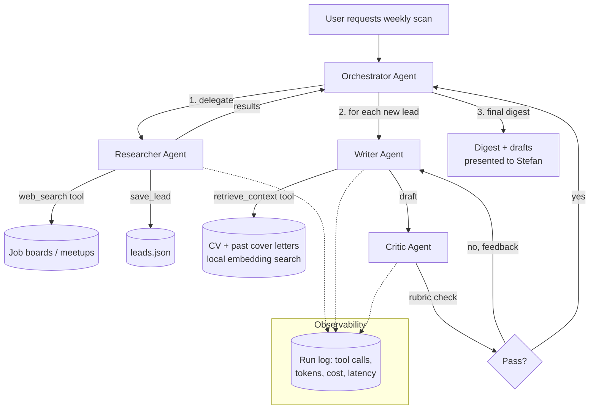

# PRD: Multi-Agent Job Search System

**Author:** Stefan Avanessian
**Status:** Draft
**Extends:** `ai-job-search-agent` (single-agent Node.js + Claude API project)

---

## 1. Overview

The existing `ai-job-search-agent` project is a single agent with a single tool-use loop: it searches job boards and meetups, checks results against exclusion/criteria rules, and saves matching leads. It does one job, adequately.

This PRD proposes evolving it into a **multi-agent system**: multiple specialised agents, each with a narrow responsibility, coordinated by an orchestrator, with a self-critique step before anything is presented as finished. The goal is not just "more agents" for its own sake — it's to produce a system where each agent's role is narrow enough to reason about independently, which is the actual argument for multi-agent architecture over a single agent doing everything.

## 2. Goals

- Split research, drafting, and quality-control into distinct agents with distinct tools and distinct prompts.
- Add a genuinely new capability the single-agent version doesn't have: drafting a tailored outreach paragraph or cover-letter bullet for a specific lead, grounded in Stefan's actual CV and past cover letters (not invented).
- Add a critic/reflection loop so drafts are checked against a rubric before being returned, rather than trusting the first output.
- Produce clean observability: every agent's tool calls, tokens, and cost, logged per run.

## 3. Non-goals

- This is not a production system with uptime guarantees, auth, or multi-user support.
- Not building a custom vector database — the corpus (CV, cover letters) is small enough that a lightweight in-memory embedding search is sufficient and more honest than reaching for infrastructure the problem doesn't need.
- Not automating LinkedIn or anything requiring a logged-in session (unchanged from the existing project's stance).

## 4. Proposed Architecture

## 5. Agent Roles

| Agent | Responsibility | Tools | Model call pattern |
|---|---|---|---|
| **Orchestrator** | Receives the request, delegates to Researcher then Writer per new lead, aggregates final output | none (routing only) | 1 call per run, low reasoning effort |
| **Researcher** | Same as the existing single-agent project: search boards/meetups, exclude known companies, save new leads | `web_search`, `list_excluded_companies`, `list_existing_leads`, `save_lead` | existing loop, unchanged |
| **Writer** | Given a specific lead, retrieve relevant CV/cover-letter context and draft a tailored outreach paragraph | `retrieve_context` (new), `save_draft` (new) | 1 call per lead, retried on critic rejection |
| **Critic** | Score a draft against a rubric; reject with specific feedback if it fails | none (pure evaluation) | 1 call per draft, structured JSON output |

## 6. Orchestration Pattern — Decision Matrix

Three ways to coordinate the agents were considered. This is included because "why this pattern and not another" is exactly the kind of question worth being able to answer, not just the fact that agents exist.

| Pattern | Implementation complexity | Debuggability | Determinism | Latency/cost | Recommended |
|---|---|---|---|---|---|
| **Sequential pipeline** (fixed order, no dynamic routing) | Low | High — linear, easy to trace | High | Lowest | Good baseline, but doesn't demonstrate orchestration judgment |
| **Supervisor/orchestrator agent** (LLM decides routing dynamically) | Medium | Medium — routing decisions need logging to stay debuggable | Medium | Medium | **Yes — chosen** |
| **Event-driven / parallel swarm** (agents publish/subscribe, no central coordinator) | High | Low — harder to reason about who did what when | Low | Highest, but fastest wall-clock if parallelised | Overkill for this problem size; noted as a future extension, not the starting point |

**Decision:** Supervisor pattern. It's the canonical multi-agent pattern, genuinely necessary here (the Writer step depends on Researcher's output; the Critic step depends on Writer's), and is complex enough to be a real interview story without being complex for no defensible reason.

## 7. New Tools Required

- **`retrieve_context(query)`** — chunks `CV.docx` and past cover letters into paragraphs, embeds them (via an embeddings API call), does cosine-similarity search against the query, returns top-N chunks. No vector DB — an in-memory array is sufficient at this corpus size, and says so explicitly if asked in an interview why nothing heavier was used.
- **`save_draft(lead_id, draft_text, status)`** — persists drafts alongside `leads.json`.
- **Critic scoring schema** — structured output (JSON) with fields: `factual_grounding` (does every claim trace to a real CV/cover-letter fact), `tone_match` (matches Stefan's established voice — no em dashes/colons, UK English, per his known rules), `specificity` (references the actual job/company, not generic), `pass` (boolean), `feedback` (string, only if pass is false).

## 8. Implementation Plan

| Phase | Work | Depends on |
|---|---|---|
| 0 | Refactor `agent.js`/`tools.js` into a shared tools library importable by multiple agents | — |
| 1 | Build Orchestrator + wire in existing Researcher unchanged | Phase 0 |
| 2 | Build `retrieve_context` (chunking + embedding + cosine search) | Phase 0 |
| 3 | Build Writer agent using `retrieve_context` and `save_draft` | Phase 2 |
| 4 | Build Critic agent + rubric + retry loop (cap at 2 retries to bound cost) | Phase 3 |
| 5 | Add per-agent logging: tool calls, tokens, cost, latency, to a run log file | Phase 1 |
| 6 (stretch) | Human-in-the-loop: drafts are not auto-sent anywhere, always require explicit review before use — consistent with how permission-gated actions already work in this codebase | Phase 4 |

**Status update:** Phase 6 is built, and ended up broader than the original scope above. Rather than just
gating outreach *sending* on human review, the pipeline now gates lead *selection* on it too — the old
autonomous Orchestrator routing decision (deciding which leads to draft for at all) has been replaced by a
Screener that scores fit but never decides, plus an explicit `npm run review` step where a person approves,
rejects, or holds every lead before Writer/Critic spend anything on it. See `README.md`'s "Why three phases
instead of one" for the reasoning, and `evals/` for the Screener's own eval suite. This was the more
important place for a human check than the send step, since a routing decision made silently and
unattended is exactly the kind of AI output worth not trusting further than it's earned.

## 9. Success Criteria / Evaluation

- **Critic pass rate on first attempt** — tracked per run. A very high first-pass rate might mean the critic is too lenient, worth interrogating rather than celebrating.
- **Cost per completed draft** (sum of Researcher + Writer + Critic + retries, in tokens and $).
- **Manual spot-check**: Stefan reviews a sample of drafts blind (without knowing which agent variant produced them) and rates 1–5 for usefulness.
- **Latency**: wall-clock time from request to final output.

## 10. Risks / Open Questions

- **Cost multiplication**: three chained agent calls plus retries costs more per run than the single-agent version. Worth measuring, not assuming — this is exactly what the companion Build-vs-Buy PRD is for.
- **RAG quality on a small corpus**: with only a handful of source documents, embedding search may not meaningfully outperform just pasting the whole CV into context. Worth testing both and being honest about the result.
- **Critic reliability**: an LLM critiquing another LLM's output is not a guarantee of quality — it's a second opinion, not ground truth. Don't oversell this in an interview as "the system verifies itself is correct."

## 11. What This Demonstrates

Multi-agent orchestration, tool design across multiple cooperating agents, retrieval-augmented generation at an appropriate (small) scale, a self-critique/retry loop, and — via the decision matrix in Section 6 — a documented rationale for the architecture chosen over the alternatives. That last part is the one most candidates skip and the one most worth having ready.
